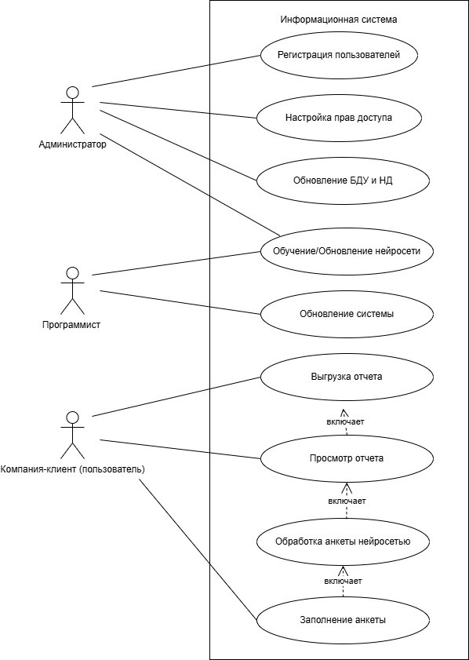

# Лабораторная работа №1. "Анализ предметной области и спецификация требований к системе ИИ"  
**Название проекта:** Информационная система анализа защищенности конфиденциальной информации с применением нейронных сетей

---

## 1. Анализ постановки задачи

**Кейс:** Информационная система анализа защищенности конфиденциальной информации с применением нейронных сетей

**Бизнес-цель:** Повышение эффективности анализа защищенности конфиденциальной информации в организациях с использованием нейронных сетей и минимизация оттока клиентов за счет своевременного предложения мер по устранению рисков

---

## 2. Сбор функциональных требований

### - Действия информационной системы

Система должна обеспечивать взаимодействие трех основных категорий пользователей (акторов):

Администратор:
- Регистрация пользователей: создание и ведение учетных записей.
- Настройка прав доступа: разграничение полномочий в соответствии с ролями пользователей.
- Обновление баз данных: актуализация базы данных угроз (БДУ) и нормативной документации (НД), обеспечивающая корректность работы алгоритмов оценки.
- Управление нейросетью: инициация процессов обучения и обновления модели для адаптации системы к новым видам киберугроз.

Программист:
- Разработка ядра системы: создание архитектуры нейросетевых моделей и алгоритмов обработки данных.
- Техническое сопровождение: внедрение обновлений, устранение программных ошибок и обеспечение непрерывной работоспособности системы.

Компания-клиент (Пользователь):
- Заполнение анкеты: внесение первичных данных об информационной системе организации.
- Получение результатов анализа: автоматизированная обработка данных нейросетью, получение вероятности рисков и бинарной классификации уровня защищенности.
- Работа с отчетами: просмотр и выгрузка сгенерированного детализированного отчета в доступном формате.
- Взаимодействие с системой: получение рекомендаций на основе выявленного уровня риска для минимизации угроз.  

### - Use Cases

**Диаграмма Use Cases UML:**  

---

## 3. Нефункциональные требования

### - Производительность
- Время ответа API на REST-запрос при оценке защищенности не должно превышать 200 мс в 95% случаев. 
- Время выполнения SQL-запросов на выборку нормативной документации или истории угроз для одного клиента не должно превышать 50 мс при базе данных объемом до 1 ТБ. 
- Процесс формирования и экспорта PDF-отчета (включая рендеринг графиков) должен завершаться в течение 30 секунд после запроса пользователя. 
- API должно выдерживать входящий поток данных со скоростью до 50 мегабайт в секунду при пакетной загрузке CSV-файлов с данными организации.

### - Масштабируемость
- Архитектура системы должна поддерживать автоматическое развертывание дополнительных контейнеров приложения при достижении загрузки CPU выше 70% на одном узле.. 
- При увеличении количества активных пользователей в 10 раз, время отклика системы не должно увеличиваться более чем в 1.5 раза при условии расширения вычислительных мощностей. 
- Процесс обучения нейросети должен быть отделен от процесса обслуживания пользователей (inference). Переобучение не должно снижать производительность API для конечных клиентов..

### - Надежность и отказоустойчивость
- В случае критического сбоя системы, она должна быть полностью восстановлена в рабочее состояние не более чем за 1 час. 
- Потеря данных при сбое не должна превышать данных за последние 5 минут (требование к частоте бэкапов базы данных).. 
- В случае обрыва соединения во время заполнения анкеты, данные не должны повреждаться, а должны сохраняться в состоянии «черновик».

### - Точность ИИ
- Точность выводов нейронной сети по критическим рискам должна составлять не менее 90%.

### - Метрики качества обслуживания (SLO/SLI)

|                    Метрика                      | Целевое значение метрики |
|-------------------------------------------------|--------------------------|
| Время отклика API (оценка защищенности)         | < 200 мс (в 95% случаев) |
| Время выполнения SQL-запросов                   | < 50 мс                  |
| Время формирования и экспорта PDF-отчета        | < 30 с                   |
| Пропускная способность загрузки данных          | до 50 МБ/с               |
| Масштабируемость (отклик при росте нагрузки х10)| не более чем в 1.5 раза  |
| Время восстановления системы                    | < 1 часа                 |
| Потеря данных при сбое                          | < 5 минут                |
| Точность прогнозов критических рисков           | > 90%                    |
| Изоляция обучения модели от API                 | полная                   |

---

## 4. Ограничения

Проектирование и эксплуатация системы ограничены следующими факторами:
- Конфиденциальность данных. Все входные данные для обучения и анализа должны быть предварительно обезличены. Использование персональных данных (PII) запрещено.
- Изоляция источников данных. Система работает на основе внутренней базы знаний и не иметь доступа к закрытым данным о деятельности или инфраструктуре конкурентов.
- Вычислительные ресурсы. Система должна быть оптимизирована для работы в контейнеризированной среде с жесткими лимитами потребления ресурсов (ограничение по объему оперативной памяти RAM и количеству ядер CPU).
- Бизнес-фокус. Алгоритмы оценки рисков должны учитывать необходимость удержания клиента (например, приоритетными должны быть рекомендации по устранению наиболее критичных для клиента угроз).

---

## 5. Контрольные вопросы

**1. Чем функциональные требования отличаются от нефункциональных в системах ИИ?**  
Функциональные требования (ЧТО система делает). Это описание действий, которые выполняет модель и сопутствующий код для достижения бизнес-цели. Они отвечают на вопрос: «Какую задачу решает ИИ?». 
Нефункциональные требования (КАК система работает). Это описание атрибутов качества, ограничений и стандартов, которым должна соответствовать работа модели. Они отвечают на вопрос: «Насколько эффективно, быстро и надежно работает ИИ?».

**2. Почему «точность модели 95%» — это нефункциональное требование?**  
Это характеристика качества, а не действие, то есть система будет выдавать результат (класс/вероятность) независимо от того, насколько она точна. Требование точности описывает качество этого результата, а не то, что результат должен быть получен. 

**3. Какие риски возникают, если не задокументировать ограничение по времени инференса?**  
- Деградация пользовательского опыта. Система может начать работать медленно, особенно при усложнении модели или росте данных. Пользователь, ожидающий отчет 30 секунд вместо 1 секунды, с высокой вероятностью закроет страницу или откажется от услуги (т.е. риск оттока).
- Каскадные сбои. Если модель считает слишком долго, запросы начинают накапливаться в очереди. Это «съедает» все свободные ресурсы (CPU/RAM) контейнера, что приводит к падению всей системы, а не только модуля классификации.
- Экономические риски. Медленная модель требует мощного «железа» (например, GPU вместо CPU). Если инференс не оптимизирован под ограничения по времени, затраты на облачные вычисления могут вырасти в десятки раз, что сделает кейс убыточным.
- Невозможность масштабирования: Если один запрос занимает 5 секунд, никогда нельзя будет достичь требования по 100 одновременным пользователям, так как ресурсы будут заблокированы текущими процессами.
